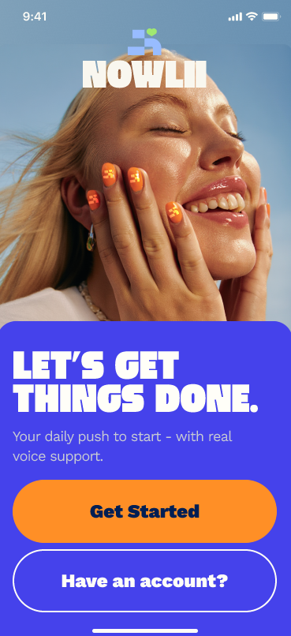
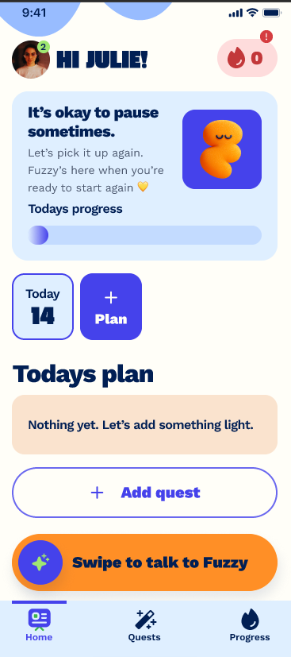
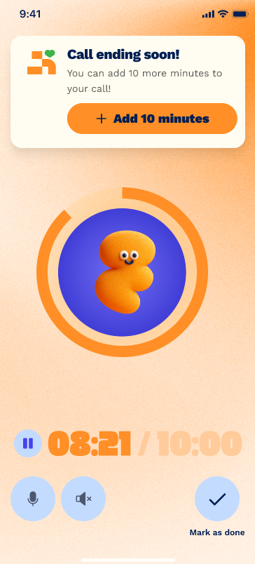
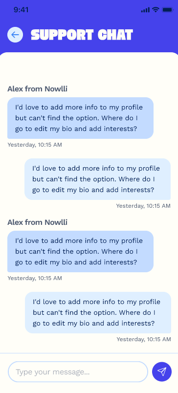

<h1 align="center">✨ NOWLII — Your AI-Powered Productivity & Wellness Companion</h1>

<p align="center">
  <em>Your daily push to start — with real voice support.</em>
</p>

<p align="center">
  
  
  
  
  
  
</p>

<p align="center">
  <a href="#-features">Features</a> •
  <a href="#-tech-stack">Tech Stack</a> •
  <a href="#-getting-started">Getting Started</a> •
  <a href="#-docker-setup">Docker Setup</a> •
  <a href="#-project-structure">Project Structure</a>
</p>

---

## 📱 App Preview

<p align="center">
  
  
  
  
</p>

---

## 📖 About

**NOWLII** is a modern productivity and wellness mobile application backend built with Django 6 and Django REST Framework. It helps users stay on track with their daily goals through an engaging quest-based system, personalized AI companion support, and real-time voice motivation.

Users can set daily quests, track progress, talk to their personal Nowlii companion (Milo, Bloop, Gumo, Knotty, Fizzy, or Zee), and get the push they need to crush their goals — all with a beautiful, vibrant UI.

---

## 🚀 Features

### 🔐 Authentication & Security
- **Email-based registration** with OTP verification (6-digit code, 15-min expiry)
- **JWT authentication** with access & refresh tokens (Bearer scheme)
- **Google OAuth 2.0** and **Apple Sign-In** via Django Allauth
- **Forgot password flow** — OTP-verified password reset
- **Password reset** for authenticated users
- **Token blacklisting** on rotation for enhanced security
- **Two-Factor Authentication** support via `django-otp`

### 👤 User Profiles
- Customizable display name, gender, and avatar (URL-based)
- Choose your **Nowlii companion**: Milo, Bloop, Gumo, Knotty, Fizzy, or Zee
- Set a **custom companion name** for a personalized experience
- **Multi-language support** — English, Deutsch, Español
- **Voice preference** — Male or Female companion voice

### 📋 Quests & Task Management
- **Create daily quests** with task descriptions, due dates, and time scheduling
- **Zone-based difficulty levels**: Soft Steps → Elevated → Power Move → Stretch Zone
- **Subtasks** — Break quests into manageable subtasks with completion tracking
- **Enable call reminders** — Get a motivational voice call from your Nowlii companion
- **Repeat quests** — Set recurring tasks for habit building
- **Alarm integration** — Set alarms for important quests
- **Task completion tracking** — Mark quests and subtasks as done

### 💳 Subscription Plans
- **Free tier** for basic features
- **Monthly** and **Yearly** premium plans
- Subscription period tracking with start/end dates

### 💬 Live Chat with Admin
- **Real-time support chat** — Talk to the NOWLII support team directly from the app
- Message history with timestamps
- Dedicated admin responses from the NOWLII team

### 🤖 AI Talking Feature
- **ChatGPT-powered conversations** — Talk to your Nowlii companion using OpenAI's API
- Personalized AI responses based on your goals and progress
- Voice-to-text and text-to-voice support for natural conversations
- Your companion remembers your quests and helps you stay motivated

### 📚 API Documentation
- **Swagger UI** auto-generated documentation at `/api/docs/`
- Fully documented endpoints with operation summaries
- Bearer token authentication support in docs
- JSON schema available at `/api/swagger.json`

---

## 🛠 Tech Stack

| Layer              | Technology                                                     |
| ------------------ | -------------------------------------------------------------- |
| **Framework**      | Django 6.0, Django REST Framework 3.16                         |
| **Language**       | Python 3.12+                                                   |
| **Auth**           | SimpleJWT, Django Allauth, django-otp, dj-rest-auth            |
| **OAuth**          | Google OAuth 2.0, Apple Sign-In                                |
| **API Docs**       | drf-yasg (Swagger / OpenAPI)                                   |
| **Container**      | Docker, Docker Compose                                         |
| **Database**       | SQLite (dev) / PostgreSQL (prod)                               |
| **Email**          | Gmail SMTP (TLS)                                               |
| **CORS**           | django-cors-headers                                            |
| **Package Mgr**    | uv (modern Python package manager)                             |
| **AI**             | OpenAI ChatGPT API                                             |

---

## 🏗 Project Structure

```
NOWLII/
├── core/                          # Django project configuration
│   ├── settings.py                # All settings (DB, Auth, JWT, Email, OAuth, etc.)
│   ├── urls.py                    # Root URL configuration + Swagger setup
│   └── ...
├── Apps/
│   ├── users/                     # User management app
│   └── quests/                    # Quest management app
├── docs/screenshots/              # App screenshots & assets
├── Dockerfile                     # Docker configuration
├── docker-compose.yml             # Docker Compose orchestration
├── manage.py                      # Django management script
├── pyproject.toml                 # Project metadata & dependencies
└── .env                           # Environment variables
```

---

## ⚡ Getting Started

### Prerequisites
- **Python 3.12+**
- **[uv](https://docs.astral.sh/uv/)** or **pip**
- **Gmail App Password**

### Local Setup
1. **Clone & Install**:
   ```bash
   git clone https://github.com/Md-Fahad-Mir/Nowlii
   cd nowlii
   uv sync
   ```
2. **Environment**: Create `.env` based on `.env.example`.
3. **Database**:
   ```bash
   uv run python manage.py migrate
   uv run python manage.py createsuperuser
   ```
4. **Run**:
   ```bash
   uv run python manage.py runserver
   ```

---

## � Docker Setup

Run the entire stack with Docker Compose:

### 1. Build and Start
```bash
docker-compose up --build
```

### 2. Apply Migrations
```bash
docker-compose exec web python manage.py migrate
```

### 3. Create Superuser
```bash
docker-compose exec web python manage.py createsuperuser
```

The app will be available at `http://localhost:8000`.


---

## 📄 License
⚠️ NOTICE: This project is a proprietary product of Dea.  
All rights reserved. No part of this repository may be copied, modified, or distributed 
without explicit permission. This repository is for reference/review purposes only. 
Unauthorized use may lead to legal consequences.

<p align="center">
  Made with ❤️ by <strong>Md Fahad Mir</strong>
</p>
